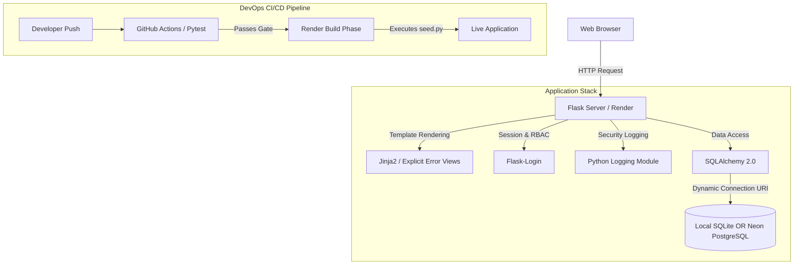
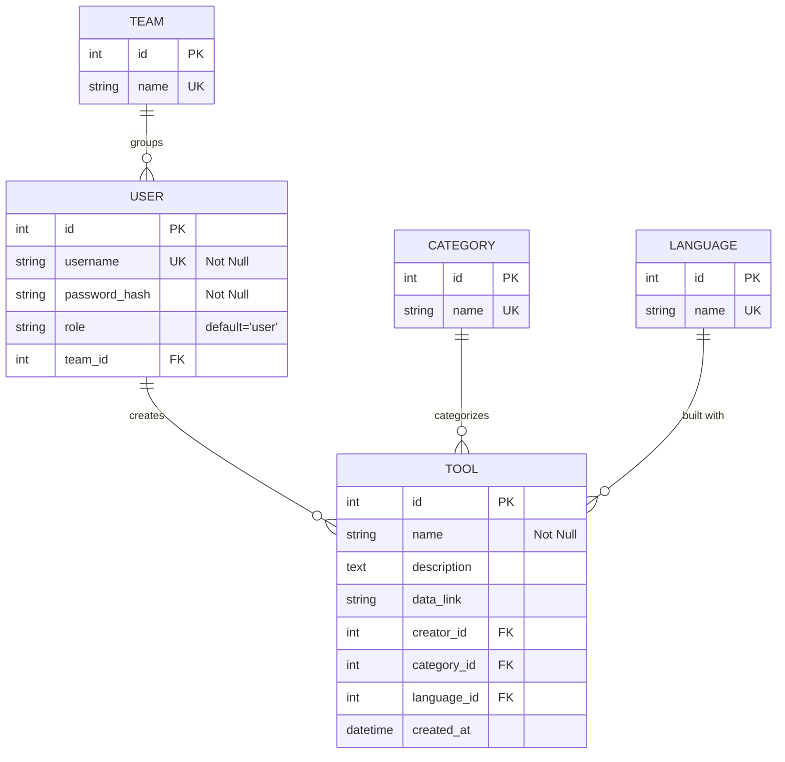
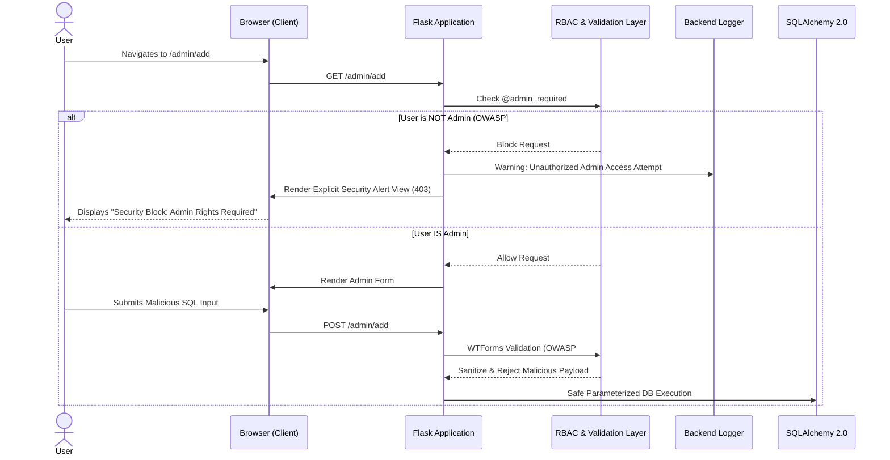

# Technical Design Document (TDD): Internal Tool Directory

## 1. System Overview & SDLC Approach
The Internal Tool Directory is a centralized, secure web application built to replace static spreadsheet tracking. The system is engineered using a strict Software Development Life Cycle (SDLC) prioritizing Test-Driven Development (TDD) and a modern DevOps CI/CD pipeline.

* **Planning & Design:** Architecture defined via explicit Entity-Relationship modeling, Deep Module structural boundaries, and CALMS-aligned DevOps strategies.
* **Develop:** Python/Flask backend using strictly parameterized SQLAlchemy 2.0 ORM queries, with logic encapsulated in deep modules.
* **Testing (CI):** Automated Continuous Integration via GitHub Actions running Pytest suites on every push.
* **Deployment (CD):** Continuous Deployment hosted live on Render, backed by a persistent Neon Serverless PostgreSQL database.

---

## 2. High-Level Architecture
The application follows a multi-tier architecture, completely decoupled from its environment to allow seamless transitions from local development to cloud production.

* **Client Layer:** HTML/CSS views rendered via Jinja2 (auto-escaping enabled). Features explicit "Security Alert" visual states for OWASP defense logging.
* **Application Layer:** Flask web server handling business logic, routing, and Role-Based Access Control (RBAC).
* **Data Access Layer:** `Flask-SQLAlchemy` utilizing **strict SQLAlchemy 2.0 syntax** (`db.session.execute(select(...))`).
* **CI/CD Infrastructure:** GitHub Actions (CI) acting as the testing gatekeeper, and Render (CD) executing automated build scripts (`seed.py`) against a remote PostgreSQL instance.



---

## 3. Entity-Relationship Diagram (ERD)
The schema normalizes metadata (Teams, Languages, Categories) into reference tables to maintain data integrity and allow for standardized WTForms dropdowns. 



---

## 4. Application Data Flow (With Security Defenses)
This flow depicts standard access alongside the explicit OWASP defense mechanisms required for examiner video evidence.



---

## 5. Codebase Structure & Deep Modules
The application limits exposed complexity by separating concerns into focused directories. The inclusion of CI/CD files (`.github`, `render.yaml`, `Makefile`) provides the necessary DevOps artifacts for assessment grading.

```text
/project_root
├── .github/
│   └── workflows/
│       └── ci.yml              # CI Pipeline: Pytest security suite
├── render.yaml                 # CD Pipeline: Infrastructure as Code (IaC)
├── Makefile                    # Build Automation Tool (Testing, Linting, Docker)
├── requirements.txt            # Python dependencies (incl. psycopg2-binary)
├── app.py                      # Flask application factory
├── models.py                   # SQLAlchemy 2.0 ORM models
├── forms.py                    # WTForms definitions
├── seed.py                     # Database initialization & CI/CD synthetic data
├── routes/                     # Deep modules for business logic
│   ├── auth.py                 # Login, Registration
│   ├── admin.py                # CRUD operations + @admin_required
│   └── errors.py               # EXPLICIT Security/OWASP Violation Handlers
├── templates/                  
│   ├── base.html               
│   ├── admin/                  
│   ├── directory/              
│   └── errors/                 # Highly visible security block views for video evidence
└── tests/                      # TDD Test Suite (pytest)
    ├── conftest.py             
    ├── test_security_owasp.py  # Explicit security tests (Auth bypass, injection)
    └── test_routes.py          
```

---

## 6. Security & Engineering Imperatives (Agent Instructions)
1.  **OWASP #5 (Broken Access Control):** A custom decorator `@admin_required` must wrap all functions in `routes/admin.py`. 
2.  **OWASP #2 (Cryptographic Failures):** Use `werkzeug.security.generate_password_hash`. Plain text passwords are mathematically barred.
3.  **OWASP #1 (Injection):** **Zero tolerance for raw SQL**. You must use `WTForms` and strictly SQLAlchemy 2.0 syntax.
4.  **CRITICAL - Explicit Security Logging & Views:** To satisfy video evidence requirements, do NOT use generic 403 pages. Create custom error views that explicitly state *"Security Alert: Broken Access Control"* or *"Security Alert: Invalid Input Detected"*. Implement Python's `logging` module to output these blocks to the server console.

---

## 7. Database Environment & CI/CD Strategy
To satisfy the DevOps Continuous Deployment requirements of the brief, the architecture utilizes a dual-database environment strategy, governed by environment variables.

* **Local Development (SQLite):** For fast, isolated local TDD loops, the application defaults to an instance-level SQLite `app.db`.
* **Live Production (Neon PostgreSQL):** Upon deployment to Render, the application detects the `DATABASE_URL` environment variable and seamlessly connects to a remote Neon Serverless PostgreSQL cluster. Because the codebase uses pure SQLAlchemy 2.0 ORM, zero query rewrites are required between environments.
* **Automated State Management (The "Destructive Build"):** To guarantee the application is fully functional for examiner testing regardless of server cold-starts, Render is configured to run `python seed.py` during its build phase. This script will programmatically drop and recreate the PostgreSQL tables, insert a default Admin user, and populate synthetic testing data, embodying the CALMS principle of "Automation."