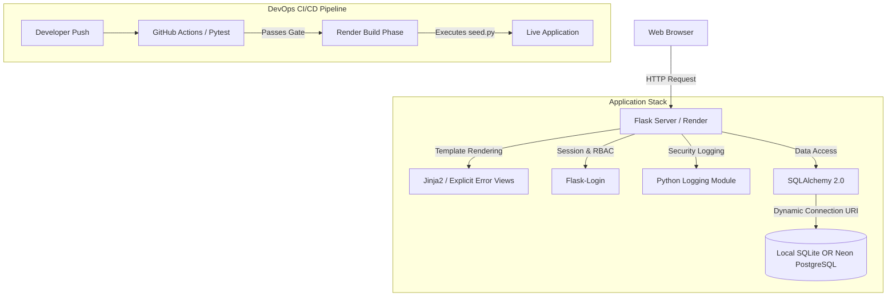
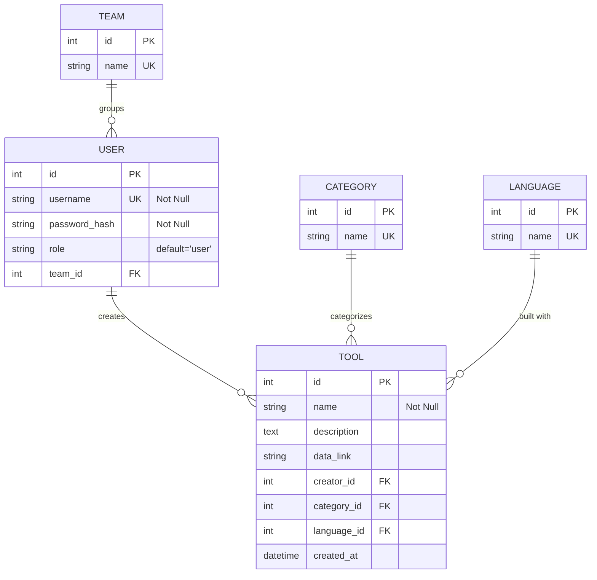
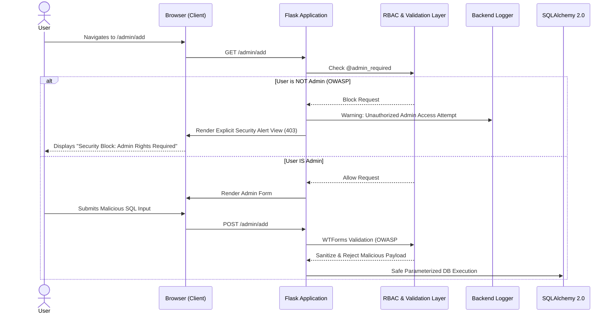

# Technical Design Document (TDD): Internal Tool Directory

## 1. System Overview & SDLC Approach
The Internal Tool Directory is a centralized, secure web application built to replace static spreadsheet tracking. The system is engineered using a strict Software Development Life Cycle (SDLC) prioritizing Test-Driven Development (TDD) and a modern DevOps CI/CD pipeline.

* **Planning & Design:** Architecture defined via explicit Entity-Relationship modeling, Deep Module structural boundaries, and CALMS-aligned DevOps strategies.
* **Develop:** Python/Flask backend using strictly parameterized SQLAlchemy 2.0 ORM queries, with logic encapsulated in deep modules.
* **Testing (CI):** Automated Continuous Integration via GitHub Actions running Pytest suites on every push.
* **Deployment (CD):** Continuous Deployment hosted live on Render, backed by a persistent Neon Serverless PostgreSQL database.

---

## 2. High-Level Architecture
The application follows a multi-tier architecture, completely decoupled from its environment to allow seamless transitions from local development to cloud production.

* **Client Layer:** HTML/CSS views rendered via Jinja2 (auto-escaping enabled). Features explicit "Security Alert" visual states for OWASP defense logging.
* **Application Layer:** Flask web server handling business logic, routing, and Role-Based Access Control (RBAC).
* **Data Access Layer:** `Flask-SQLAlchemy` utilizing **strict SQLAlchemy 2.0 syntax** (`db.session.execute(select(...))`).
* **CI/CD Infrastructure:** GitHub Actions (CI) acting as the testing gatekeeper, and Render (CD) executing automated build scripts (`seed.py`) against a remote PostgreSQL instance.


```mermaid
graph TD
    Client[Web Browser] -->|HTTP Request| FlaskApp[Flask Server / Render]
    
    subgraph DevOps CI/CD Pipeline
        Dev[Developer Push] --> GH[GitHub Actions / Pytest]
        GH -->|Passes Gate| RenderBuild[Render Build Phase]
        RenderBuild -->|Executes seed.py| AppState[Live Application]
    end

    subgraph Application Stack
        FlaskApp -->|Template Rendering| Views[Jinja2 / Explicit Error Views]
        FlaskApp -->|Session & RBAC| Auth[Flask-Login]
        FlaskApp -->|Security Logging| Logger[Python Logging Module]
        FlaskApp -->|Data Access| ORM[SQLAlchemy 2.0]
        ORM -->|Dynamic Connection URI| DB[(Local SQLite OR Neon PostgreSQL)]
    end
```

---

## 3. Entity-Relationship Diagram (ERD)
The schema normalizes metadata (Teams, Languages, Categories) into reference tables to maintain data integrity and allow for standardized WTForms dropdowns. 


```mermaid
erDiagram
    USER {
        int id PK
        string username UK "Not Null"
        string password_hash "Not Null"
        string role "default='user'"
        int team_id FK
    }
    TEAM {
        int id PK
        string name UK
    }
    LANGUAGE {
        int id PK
        string name UK
    }
    CATEGORY {
        int id PK
        string name UK
    }
    TOOL {
        int id PK
        string name "Not Null"
        text description
        string data_link
        int creator_id FK
        int category_id FK
        int language_id FK
        datetime created_at
    }

    TEAM ||--o{ USER : "groups"
    USER ||--o{ TOOL : "creates"
    CATEGORY ||--o{ TOOL : "categorizes"
    LANGUAGE ||--o{ TOOL : "built with"
```

---

## 4. Application Data Flow (With Security Defenses)
This flow depicts standard access alongside the explicit OWASP defense mechanisms required for examiner video evidence.


```mermaid
sequenceDiagram
    actor U as User
    participant UI as Browser (Client)
    participant App as Flask Application
    participant Security as RBAC & Validation Layer
    participant Log as Backend Logger
    participant ORM as SQLAlchemy 2.0

    U->>UI: Navigates to /admin/add
    UI->>App: GET /admin/add
    App->>Security: Check @admin_required
    
    alt User is NOT Admin (OWASP #A5 Defense)
        Security-->>App: Block Request
        App->>Log: Warning: Unauthorized Admin Access Attempt
        App->>UI: Render Explicit Security Alert View (403)
        UI-->>U: Displays "Security Block: Admin Rights Required"
    else User IS Admin
        Security-->>App: Allow Request
        App->>UI: Render Admin Form
        U->>UI: Submits Malicious SQL Input
        UI->>App: POST /admin/add
        App->>Security: WTForms Validation (OWASP #A1 Defense)
        Security-->>App: Sanitize & Reject Malicious Payload
        App->>ORM: Safe Parameterized DB Execution
    end
```

---

## 5. Codebase Structure & Deep Modules
The application limits exposed complexity by separating concerns into focused directories. The inclusion of CI/CD files (`.github`, `render.yaml`, `Makefile`) provides the necessary DevOps artifacts for assessment grading.

```text
/project_root
├── .github/
│   └── workflows/
│       └── ci.yml              # CI Pipeline: Pytest security suite
├── render.yaml                 # CD Pipeline: Infrastructure as Code (IaC)
├── Makefile                    # Build Automation Tool (Testing, Linting, Docker)
├── requirements.txt            # Python dependencies (incl. psycopg2-binary)
├── app.py                      # Flask application factory
├── models.py                   # SQLAlchemy 2.0 ORM models
├── forms.py                    # WTForms definitions
├── seed.py                     # Database initialization & CI/CD synthetic data
├── routes/                     # Deep modules for business logic
│   ├── auth.py                 # Login, Registration
│   ├── admin.py                # CRUD operations + @admin_required
│   └── errors.py               # EXPLICIT Security/OWASP Violation Handlers
├── templates/                  
│   ├── base.html               
│   ├── admin/                  
│   ├── directory/              
│   └── errors/                 # Highly visible security block views for video evidence
└── tests/                      # TDD Test Suite (pytest)
    ├── conftest.py             
    ├── test_security_owasp.py  # Explicit security tests (Auth bypass, injection)
    └── test_routes.py          
```

---

## 6. Security & Engineering Imperatives (Agent Instructions)
This section maps implemented controls to **OWASP Top 10 (2017)** and critically evaluates current maturity.

### 6.1 Implemented OWASP 2017 Controls
1.  **A5:2017 Broken Access Control**
    - Implemented via the custom `@admin_required` decorator on all admin routes and explicit `403` blocking behavior.
    - Attempts are logged and surfaced through explicit security messaging in the UI, improving visibility for both testing and incident triage.

2.  **A2:2017 Broken Authentication**
    - Passwords are hashed with `werkzeug.security.generate_password_hash` and verified with hash comparison, not plaintext checks.
    - Session management is delegated to `Flask-Login`, reducing custom authentication surface area.

3.  **A1:2017 Injection**
    - Database access uses SQLAlchemy ORM patterns and parameterized query construction.
    - Input constraints are enforced through WTForms validators before state-changing operations.
    - No raw SQL path is used in application routes.

4.  **A10:2017 Insufficient Logging & Monitoring (partial control)**
    - Security-relevant events such as blocked admin route access are logged.
    - Explicit security views make denial events observable during assessment evidence capture.

### 6.2 Critical Evaluation Of Current Security Posture
Strengths:

- Controls are embedded in architecture, not bolted on late, especially RBAC and ORM-first data access.
- Security behavior is testable through automated pytest coverage, improving confidence in regression resistance.
- Error handling includes explicit security messaging, supporting traceability and evidence quality.

Limitations and risk gaps:

- **A5 depth limitation:** current RBAC is role-level only (admin vs non-admin). It does not yet enforce fine-grained, record-level authorization policies.
- **A2 maturity limitation:** no explicit brute-force protections (for example, account lockout, throttling, or adaptive risk checks).
- **A10 maturity limitation:** logging is present but not yet structured as a full monitoring pipeline (alert thresholds, central aggregation, incident response hooks).
- **Operational security limitation:** destructive seeding in deployment paths introduces data integrity and availability risk, which can become a security concern under real operational constraints.

Overall judgement:

The implementation demonstrates strong foundational security engineering for coursework-level scope, but production-grade maturity would require stronger authentication hardening, deeper authorization granularity, and security operations controls.

### 6.3 Additional OWASP 2017 Example Recommended For Higher Marks
**Recommended addition: A9:2017 Using Components with Known Vulnerabilities**

Rationale:

- The application depends on third-party packages (Flask, SQLAlchemy, WTForms, psycopg2, etc.), so dependency risk is a live attack surface.
- Addressing A9 demonstrates security beyond application logic and shows DevSecOps awareness, which is often rewarded in higher-band marking.

How to implement in this project:

1. Add an automated dependency vulnerability scan in CI (for example, `pip-audit`).
2. Fail CI builds on known vulnerabilities above an agreed severity threshold.
3. Pin and regularly refresh dependencies as part of release hygiene.
4. Document remediation decisions (upgrade, temporary exception, or replacement) in commit/PR notes.

Example CI integration approach:

- Install scanner in pipeline after dependency install.
- Run scanner before tests.
- Treat vulnerability findings as a quality gate, equivalent to failing unit tests.

Critical evaluation of this recommendation:

- **Benefit:** reduces exploit exposure from vulnerable libraries and demonstrates proactive security governance.
- **Trade-off:** can increase maintenance workload and may temporarily block delivery when upstream fixes are unavailable.
- **Mitigation:** use risk-based exception windows with documented justification and expiry dates.

### 6.4 Suggested Security Enhancement Roadmap
1. Short-term: add A9 dependency scanning gate in CI and introduce login throttling.
2. Medium-term: introduce structured security logging with central aggregation and alerting.
3. Longer-term: implement finer-grained authorization controls (ownership/team-based access policies).

---

## 7. Database Environment & CI/CD Strategy
To satisfy the DevOps Continuous Deployment requirements of the brief, the architecture utilizes a dual-database environment strategy, governed by environment variables.

* **Local Development (SQLite):** For fast, isolated local TDD loops, the application defaults to an instance-level SQLite `app.db`.
* **Live Production (Neon PostgreSQL):** Upon deployment to Render, the application detects the `DATABASE_URL` environment variable and seamlessly connects to a remote Neon Serverless PostgreSQL cluster. Because the codebase uses pure SQLAlchemy 2.0 ORM, zero query rewrites are required between environments.
* **Automated State Management (Current Coursework Mode):** To guarantee the application is fully functional for examiner testing regardless of server cold-starts, Render is configured to run `python seed.py` during its build phase. This script programmatically drops and recreates PostgreSQL tables, inserts a default Admin user, and populates synthetic testing data.

### 7.1 Critical Analysis: Why the Current Destructive Build Is Not Production-Safe
The current strategy is valid for assessment/demo reliability but unsuitable for a real organisational system handling live operational data.

Key issues:

1. **Data loss risk:** `drop_all()` and reseeding on each deploy will erase real user-created records.
2. **Audit and compliance failure:** destructive resets can invalidate audit trails and conflict with governance requirements (for example, retention obligations).
3. **Operational fragility:** every release becomes a high-risk event because deployment and data reinitialisation are tightly coupled.
4. **Rollback weakness:** if a release fails after reseeding, service may recover but business data remains lost or inconsistent.
5. **Security exposure:** default seeded credentials are acceptable for demo environments but unacceptable for production security posture.

From a DevOps perspective, this approach over-optimises for repeatable demo state while under-optimising for reliability, recoverability, and data stewardship.

### 7.2 Realistic Production State Management Strategy (Recommended)
For a real organisation using live data, deployment should be **non-destructive** and **migration-driven**.

Recommended model:

1. **Use schema migrations, not table drops**
    - Adopt a migration tool (for example, Flask-Migrate/Alembic).
    - Run forward-only, versioned migrations during deployment.
2. **Separate reference-data bootstrap from transactional data**
    - Keep idempotent bootstrap scripts for fixed lookup data (teams/categories/languages).
    - Never overwrite user-generated transactional records during deploy.
3. **Environment-gate seeding behavior**
    - Allow full reseed only in local/test environments.
    - Block destructive seed operations in production by policy and runtime safeguards.
4. **Protect production credentials and identities**
    - Remove default admin accounts from production seeds.
    - Provision initial admin users through secure onboarding or one-time protected setup scripts.
5. **Introduce backup and restore controls**
    - Enforce automated backups, tested restore procedures, and rollback playbooks.
    - Treat backup verification as a release gate for high-risk database changes.

### 7.3 Suggested Environment Policy
The following policy keeps the coursework workflow intact while aligning production behavior with real-world standards:

- **Local/Test:** allow full reseed (`drop/create/seed`) for fast iteration and deterministic test data.
- **Staging:** use migrations + non-destructive reference-data sync; optionally refresh from anonymised snapshots.
- **Production:** migrations only, no destructive seed path, mandatory backups, and controlled privileged account provisioning.

This separation preserves the educational value of automated seeding while demonstrating professional judgement about data integrity, business continuity, and secure operations in real organisational contexts.

### 7.4 How `ci.yml` Is Used In The Current Pipeline
The GitHub Actions workflow in `.github/workflows/ci.yml` is currently the primary **Continuous Integration** gate.

Operational flow:

1. Trigger on push/pull request to `main`.
2. Start a PostgreSQL service container (`postgres:16`) for integration-style database tests.
3. Inject CI environment variables (`SECRET_KEY`, `DATABASE_URL`) for test execution.
4. Install dependencies from `requirements.txt`.
5. Run `python seed.py` to reset schema and load deterministic test data.
6. Execute `pytest -q` as the quality gate.

This is directly connected to the application code because tests validate security and behavior in routes, forms, ORM models, and RBAC logic before changes are accepted.

Critical analysis:

- **Strength:** good reproducibility due to clean database state per run.
- **Strength:** catches security regressions early because OWASP-focused tests run in CI.
- **Limitation:** this workflow is CI only; it does not build/sign/publish a deployable artifact or execute release promotion gates.
- **Limitation:** destructive reseed is acceptable in CI, but the pattern must not leak into production deployment stages.
- **Limitation:** no explicit static analysis/security dependency scanning stage is included.

### 7.5 How The `Dockerfile` Is Used To Containerise The Application
The `Dockerfile` defines a container image for the Flask application by:

1. Starting from `python:3.13-slim`.
2. Setting runtime environment flags and Flask defaults.
3. Copying and installing Python dependencies.
4. Copying source code into `/app`.
5. Exposing port `5000`.
6. Starting the app with `python seed.py && python -m flask run`.

Critical analysis of current container start command:

- **Positive:** deterministic startup for demo use, because schema/data are guaranteed at launch.
- **High risk for real production:** running `python seed.py` at container start is destructive where `seed.py` performs drop/recreate logic.
- **Operational concern:** `flask run` is a development server, not ideal as a hardened production process manager.
- **Release concern:** coupling data reset with container startup makes scaling and restarts risky for live data.

### 7.6 CI/CD Clarity: Current State Vs Production-Grade State
Current state in this repository should be described as:

- **CI:** implemented via GitHub Actions (`ci.yml`) with seeded DB and automated tests.
- **CD:** platform-level deployment via Render configuration, currently using runtime/build commands rather than an image promotion pipeline.

Production-grade target state for organisations with real data:

1. CI builds and tests code, then produces an immutable artifact (for example, a versioned Docker image).
2. CD promotes the tested artifact across environments (staging to production) with approval and rollback controls.
3. Database migrations run as non-destructive release steps; seed scripts are environment-gated and non-destructive in production.
4. Container runtime command starts only the application service process; database reset logic is removed from normal startup.

This distinction improves accuracy in pipeline terminology and demonstrates critical understanding of DevOps maturity beyond coursework-oriented automation.